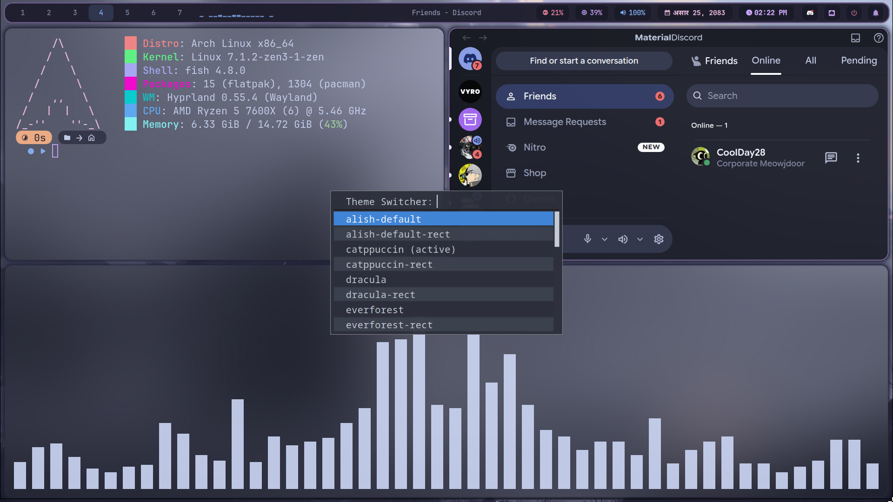

# My Hyprland Rice 🌸

A personal Hyprland desktop setup with a built-in palette switcher, custom `cava` audio visualizer shaders, and a fully modular Lua-based config.



## ✨ Features

- **Multiple color palettes**, switchable on the fly: Catppuccin, Dracula, Nord, Gruvbox, Everforest, Rosé Pine, Synthwave, Tokyo Night — each with its own matching wallpaper set
- **Modular Lua config** for Hyprland (`hypr/alish/`) — keybinds, monitors, autostart, input, window rules, and visuals all split into separate files
- **Custom `cava` shaders** for the audio visualizer (Saturn rings, northern lights, orion circle, and more)
- **7 different rofi launcher styles** (`type-1` through `type-7`) with swappable color schemes
- **Waybar** with a live cava spectrum module and custom scripts (Nepali calendar/date, workspace scroll)
- **Hyprlock** lockscreen, **wlogout** power menu, **swaync** notifications, **waypaper** wallpaper picker
- Fish shell with Starship prompt

## 📦 What's included

```
dotfiles/
├── cava/       → audio visualizer config + custom GLSL shaders
├── fastfetch/  → system info fetch config
├── fish/       → shell config
├── hypr/       → Hyprland config, palettes, wallpapers, hyprlock
├── kitty/      → terminal config
├── nvim/       → Neovim config
├── rofi/       → 7 launcher styles with matching color themes
├── starship.toml
├── swaync/     → notification center styling
├── waybar/     → status bar config + scripts
├── waypaper/   → wallpaper picker config
└── wlogout/    → power menu
```

## 🚀 Installation

> ⚠️ These are **my personal configs** — back up your existing `~/.config` before overwriting anything, and read through the files first. Some settings (monitor layout, lockscreen image) are specific to my machine and need to be adjusted for yours.

1. Clone the repo:
   ```bash
   git clone https://github.com/alish07-zeno/dotfiles.git
   cd dotfiles
   ```

2. Copy the folders you want into `~/.config/`:
   ```bash
   cp -r hypr waybar rofi kitty fish swaync wlogout waypaper nvim fastfetch cava ~/.config/
   cp starship.toml ~/.config/
   ```

3. **Edit these before launching Hyprland:**
   - `hypr/alish/monitors.lua` — set your own monitor names/resolution/refresh rate
   - `hypr/hyprlock.conf` — replace the lockscreen image path (`alishlockscreen.png` placeholder) with your own image
   - `waypaper/config.ini` — update any hardcoded paths if you moved the config elsewhere

4. Install dependencies (adjust for your distro/package manager):
   ```
   hyprland waybar rofi kitty fish starship swaync wlogout waypaper cava fastfetch neovim
   ```

5. Launch Hyprland and enjoy 🎉

## 🎨 Switching palettes

Palettes live in `hypr/themes/palettes/`. Use the theme menu script to switch:
```bash
bash ~/.config/hypr/themes/menu.sh
```
Each palette comes with a matching wallpaper set in `hypr/themes/wallpapers/`.

## 🙏 Credits

- Rofi launcher styles (`type-1` to `type-7`) based on themes by **Aditya Shakya ([adi1090x](https://github.com/adi1090x))**, with a Tokyo Night color scheme by **Levi Lacoss (fishyfishfish55)**
- Cava GLSL shaders by **rezky_nightky**

## 📺 Video

Check out the full setup walkthrough on my YouTube channel: *(will upload soon)*

## License

MIT — use, remix, and share freely.
